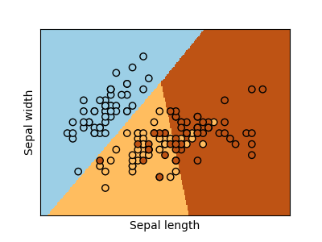
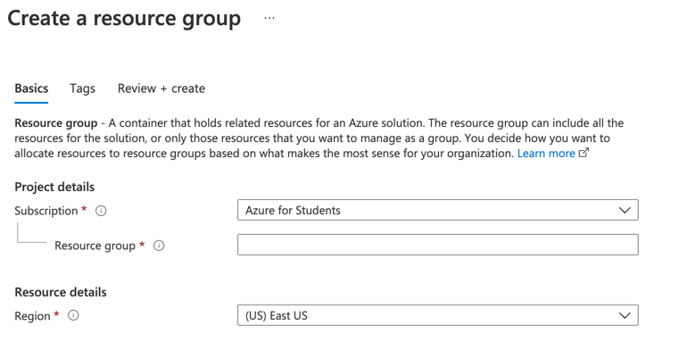
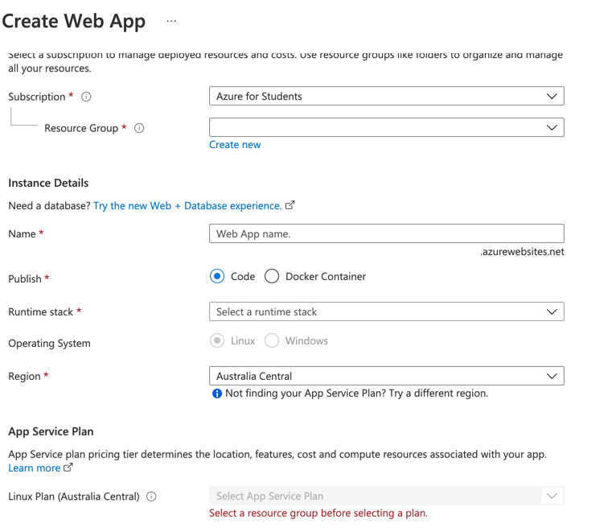
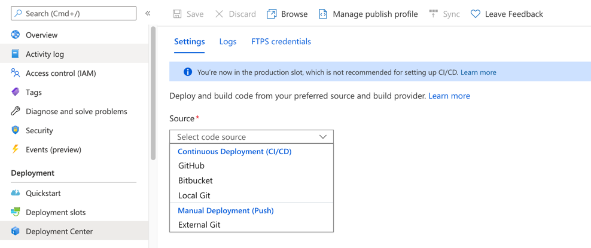
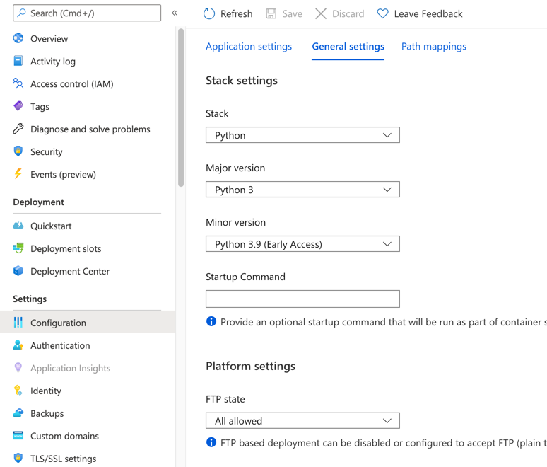

# deployment-fastAPI_azure

This is an example of how to deploy a maching learning model using Scikit-learn, FastAPI and Docker containers, the model is a logistic-regression classifier of the iris dataset.

## Run it locally

1. Create a virtual environment`python3 -m venv .venv`
2. Activate the virtual environment `source .venv/bin/activate`
3. Install the requirements `pip install -r modelling/requirements.txt` & `pip install -r app/requirements.txt`
4. Train the model and save it `python modelling/train.p`
5. Run the unvicorn server `uvicorn app.main:app --reload`

## On Microsoft Azure

1. Create a `start.sh` file and put there all the commands you want to run
2. Create an account on the Microsoft Azure portal
3. Create a resource group and pick a name of your preference
4. 

4. Go to `App services` and click `create
5. Select the resource group you just created, create a unique name for your app, select the option `code`, select the runtime stack `pyton 3.9`, select the region closest to your location and finally click `Review + create`

6. Go to `Deployment -> Deployment Center`, click `GitHub` and link your Guthub account to this platform

7. Go to `Configuration -> General settings`, write `start.sh` in `Startup Command`input textbox.

